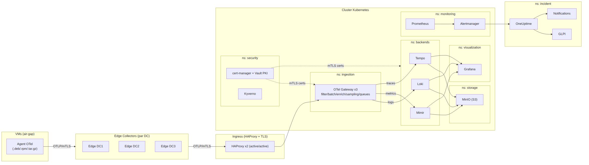
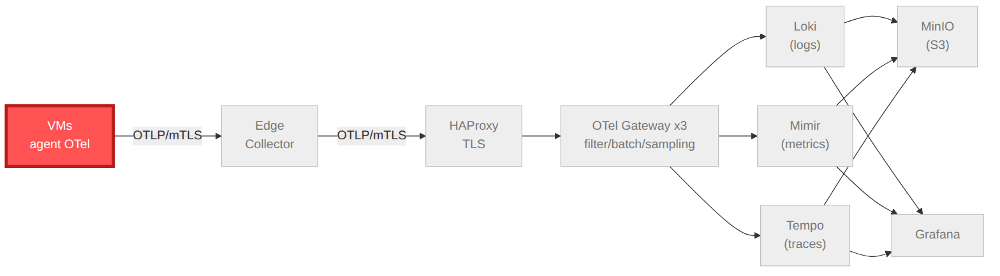

# Architecture

Plateforme d'observabilité 100% open source, GitOps et DevSecOps, reproductible par environnement.

**Flux de données (animé)** :

## Couches

1. **Collecte** — agents OpenTelemetry sur les VMs (air-gap), métriques système + logs + traces.
2. **Edge** — un Edge Collector par datacenter : buffer, filtre préliminaire, compression.
3. **Ingress** — HAProxy (x2 active/active), terminaison TLS, équilibrage least-connections.
4. **Ingestion** — OTel Gateway (x3) : filter, batch, enrichissement, tail sampling, files
   persistantes, export vers les backends.
5. **Backends** — Loki (logs), Mimir (métriques), Tempo (traces), tous adossés à MinIO (S3).
6. **Stockage** — MinIO distribué pour le long terme (versioning, chiffrement au repos).
7. **Monitoring** — Prometheus + Alertmanager + auto-healing.
8. **Visualisation** — Grafana (datasources + dashboards as-code, corrélation croisée).
9. **Incident** — OneUptime → GLPI (tickets) + notifications.
10. **Sécurité (transversale)** — Vault PKI/mTLS, cert-manager, NetworkPolicies, Kyverno, RBAC.

## Principes

- **GitOps** : Git = source de vérité, FluxCD réconcilie ; promotion par PR.
- **Reproductibilité** : toute la variabilité dans `environments/<env>/`.
- **Sécurité par défaut** : mTLS de bout en bout, secrets SOPS, supply chain signée.

Voir aussi : [flux de données](data-flow.md) · [décisions (ADR)](adr/) ·
[fonctionnement](../how-it-works/README.md).
