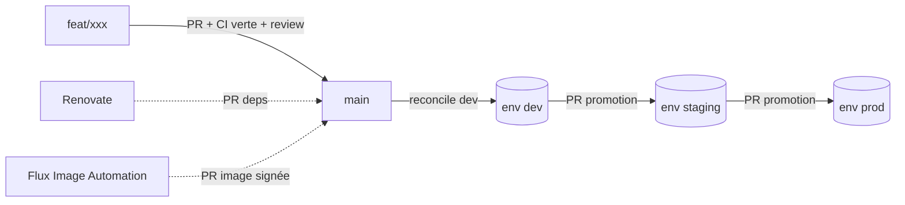

# Workflow Git / Pull Requests

La plateforme est pilotée en **GitOps** : Git est la source de vérité, FluxCD réconcilie le
cluster. Toute évolution passe par une **Pull Request** avec CI bloquante.

## Stratégie de branches

- `main` — état déployé en **production**, branche **protégée** (jamais de push direct).
- Branches de feature (`feat/...`, `fix/...`) — courtes, mergées par PR.
- Promotion entre environnements **par PR** : `dev` → `staging` → `prod` (le diff Flux et le
  plan Terraform sont visibles dans la PR avant merge).

## Garde-fous (branch protection sur `main`)

- Pull Request **obligatoire**, au moins **1 review** (via `CODEOWNERS`).
- **Status checks** CI verts requis : `lint`, `validate`, `security`, `policy`.
- Pas de **force-push**, historique **linéaire**.
- Titre de PR au format **Conventional Commits** (validé en CI) → changelog & SemVer automatiques.

## CODEOWNERS

Chaque dossier a ses responsables (voir [`.github/CODEOWNERS`](../../.github/CODEOWNERS)) :
`platform/security/` → équipe sécurité, `bootstrap/` → infra/plateforme, etc. La revue des bonnes
personnes est demandée automatiquement.

## CI sur chaque PR (bloquante)

| Job | Outils |
|---|---|
| `lint` | yamllint, terraform fmt, tflint, ansible-lint |
| `validate` | kubeconform |
| `security` | gitleaks, trivy, checkov, tfsec, kubescape |
| `policy` | conftest / OPA |
| `supply-chain` | syft (SBOM) + cosign (signature) |
| `iac-plan` | terraform validate + commentaire de plan/diff sur la PR |

Un échec **bloque le merge**.

## Automatisation par PR

- **Renovate** — PRs de mise à jour des dépendances (Terraform, charts Helm, images, GitHub
  Actions). Minor/patch sûrs en auto-merge, majeures en revue humaine.
- **Flux Image Automation** — ouvre une PR quand une nouvelle image **signée** est disponible
  dans le dépôt interne.
- **Drift detection** — Flux alerte si l'état du cluster diverge de Git.

## Cycle type

1. `git switch -c feat/ajout-dashboard`
2. Modifier le code / la config.
3. `make validate && make scan` en local.
4. `git commit -m "feat: ajoute le dashboard latence ingestion"` puis push.
5. Ouvrir la PR → la CI tourne, les CODEOWNERS revoient.
6. Merge sur `main` → Flux réconcilie l'environnement cible.
7. Promotion vers staging/prod par PR successives.
