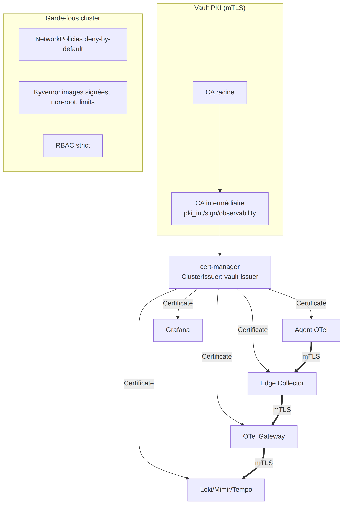
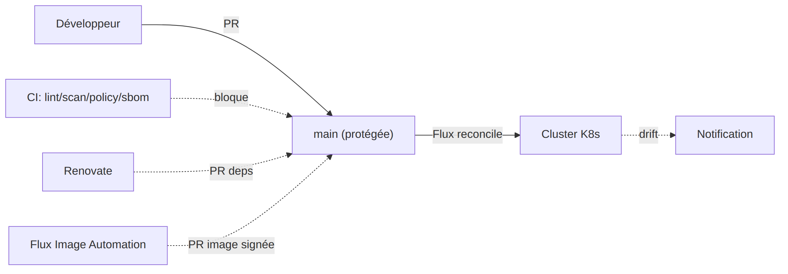

# docs/imgs — Schémas et visuels du projet

Diagrammes sources (Mermaid `.mmd`) — rendus en SVG/PNG par la CI docs ou localement :

```bash
# Rendu local d'un diagramme
npx -y @mermaid-js/mermaid-cli -i docs/imgs/architecture.mmd -o docs/imgs/architecture.svg
```

| Source (`.mmd`) | Rendu | Contenu |
|---|---|---|
| `architecture.mmd` | `architecture.png` | Architecture globale (collecte → ingestion → backends → visu → incident) |
| `security.mmd` | `security.png` | Chaîne mTLS (Vault PKI → cert-manager) + garde-fous cluster |
| `gitops-flow.mmd` | `gitops-flow.png` | Workflow GitOps / Pull Requests |
| _(frames)_ | `data-flow.gif` | **Animation** du flux de données (VM → edge → LB → gateway → backends → S3/Grafana) |

## Aperçus

### Architecture


### Flux de données (animé)


### Sécurité (mTLS)


### Workflow GitOps / PR


> Captures d'écran de démonstration (Grafana, OneUptime) : déposer sous `screenshots/` et les
> référencer depuis `docs/how-it-works/`.
